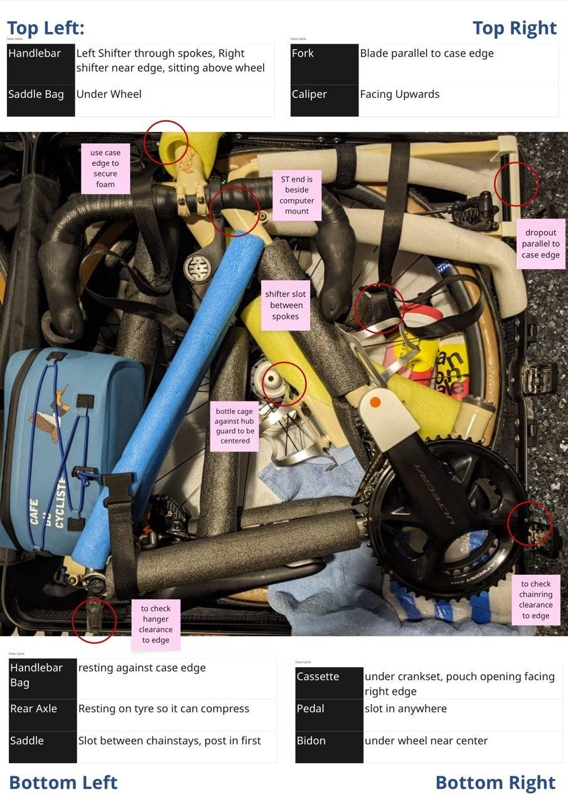

## Drivetrain & Components

| Item                 | What to check      | Spec                                           | Done |
| -------------------- | ------------------ | ---------------------------------------------- | ---- |
| Chain                | Clean & lube       | Fresh wax or drip lube before departure        | [ ]  |
| Chain                | Chain wear         | .75x tool                                      | [ ]  |
| Cassette & chainring | Wear               | Replace if shark-toothed or skipping           | [ ]  |
| Brakes               | Check fluid levels | topped up, no spongy feel, no leaks at coupler | [ ]  |
| Brake pads           | Thickness          | Replace if <50% remaining                      | [ ]  |
| Di2                  | Charge             | Full charge before packing                     | [ ]  |

## Wheels & Tyres

| Item | What to check | Spec | Done |
|---|---|---|---|
| Spokes | Tension | True wheels, no loose spokes | [ ] |
| Tyres | Condition | No cuts, bulges, or worn tread | [ ] |
| Tubes| Punctures | pump to 60PSI,leave inflated 3 days | [ ] |
| Spares | Carry | 2× tubes/ bike, tyre , pump | [ ] |
| Tyre pressure | Inflate | Add ~5-10psi over normal for loaded alpine descending | [ ] |

## Electronics → Travel Mode

| Item | What to check | Spec | Done |
|---|---|---|---|
| Pedals | Remove | Using 8mm hex or pedal wrench | [ ] |
| — Favero Assioma | App | put pedals in travel mode | [ ] |
| — Shimano | Di2 Battery | Central Battery disconnected and dummy plugged | [ ] |
| Di2 | Charge | Full charge (lasts ~2,000km but don't chance it) | [ ] |
| Head unit | Charge | Garmin/Wahoo + any sensors | [ ] |
| Charging cables | Pack | USB-C for Garmin/Wahoo, Di2 charger cable | [ ] |
| Spare batteries | Pack | For HR strap, speed/cadence sensors | [ ] |

## Bolts & Torque Check

| Item | Torque | Done |
|---|---|---|
| Stem & handlebar bolts | 5-6 Nm | [ ] |
| Seatpost clamp | 5-6 Nm (or spec) | [ ] |
| Saddle rails | 4-5 Nm | [ ] |
| Derailleur hanger | Straight, bolt tight | [ ] |
| Pedal threads | Grease before reinstallation | [ ] |

## Packing & Travel

| Item              | What to check    | Spec                                                                    | Done |
| ----------------- | ---------------- | ----------------------------------------------------------------------- | ---- |
| Frame protection  | Pack             | Pipe insulation on top tube, fork spacer                                | [ ]  |
| Derailleur hanger | Protect          | Protector or remove RD entirely                                         | [ ]  |
| Handlebar         | Loosen & turn    | Taped in place                                                          | [ ]  |
| Pedals            | Pack in carry-on | Lighter + safer from theft                                              | [ ]  |
| Tools             | Pack             | Multi-tool with chain breaker, tyre levers, pedal wrench, torque wrench | [ ]  |
| Bike box weight   | Check            | Under airline limit (typically 23-30kg)                                 | [ ]  |

## Final Shakedown (Week Before)

| Item | What to check | Done |
|---|---|---|
| Test ride | 30min after reassembly with shifting, braking, and a climb effort | [ ] |
| Di2 shifting | Check under load | [ ] |
| Brake pads | Bed in if replaced | [ ] |
| Power meter | Confirm sync to head unit | [ ] |
| Loaded ride | Ride with full bottles + bags + tools to feel handling difference | [ ] |

## Box Layout

> Much pain has been taken to find the best orientation to fit all parts of this bike into this humble box that just barely fits into airline check-in dimensions.

