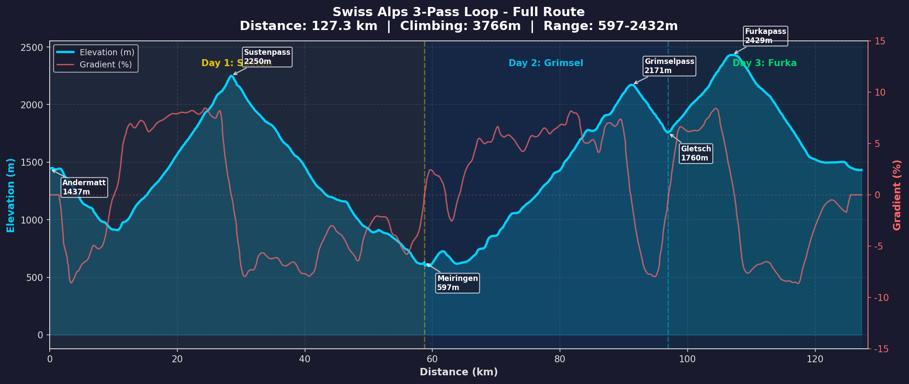
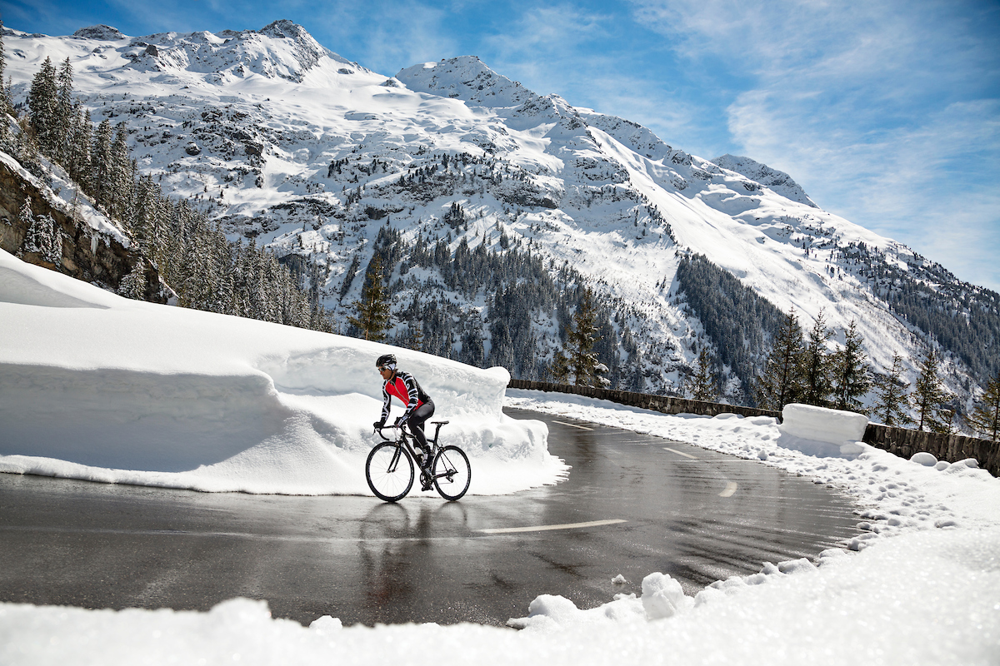
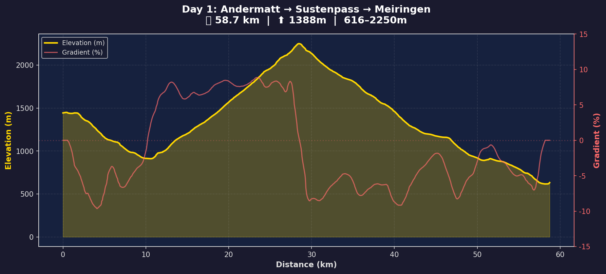
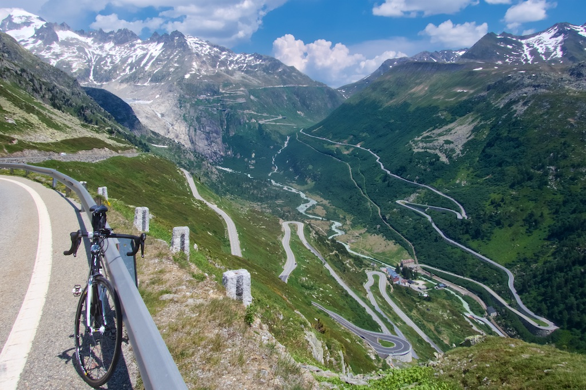
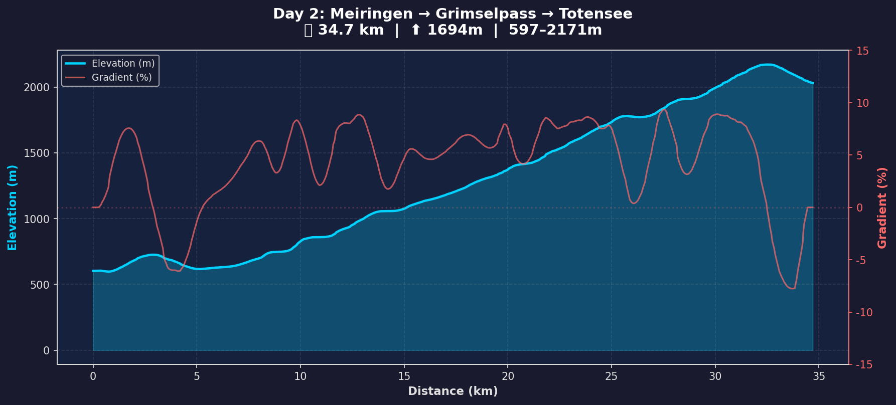
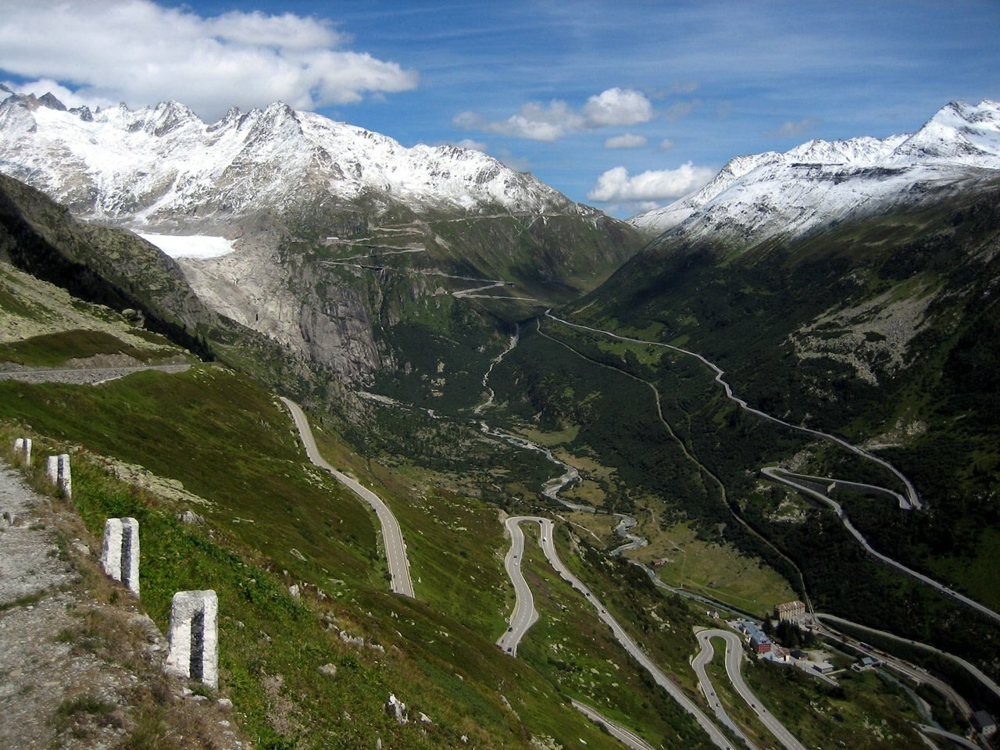
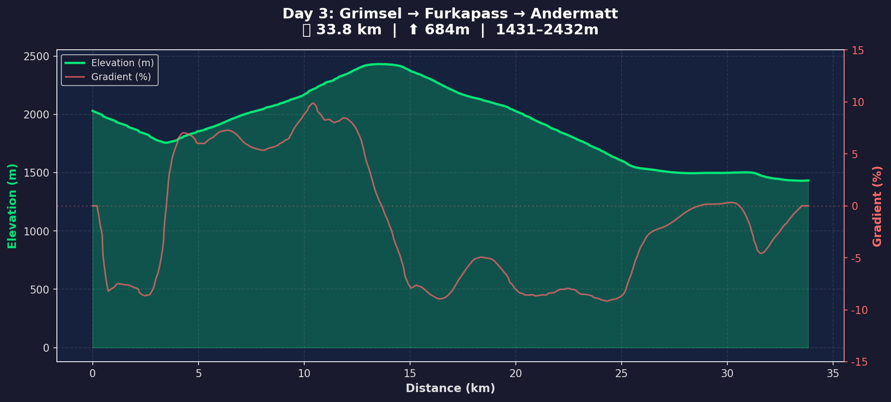

### Welcome to the Alps

**The Plan:** One pass per day. Leave car + luggage at Andermatt, ride light, hotels handle the rest.

**Total distance:** 127.2 km
**Total climbing:** 3,766 m

| | Day 1: Susten | Day 2: Grimsel | Day 3: Furka |
|---|---|---|---|
| **Route** | Andermatt → Meiringen | Meiringen → Totensee | Gletsch → Andermatt |
| **Distance** | 58.7 km | 34.7 km | 33.8 km |
| **Climbing** | 1,388 m | 1,694 m | 684 m |
| **Elevation range** | 616 m – 2,250 m | 597 m – 2,171 m | 1,431 m – 2,432 m |
| **Highest point** | 2,250 m | 2,171 m | 2,429 m |
| **Difficulty** | 🟠 Long climb & descent | 🔴 Continuous grind | 🟡 Punchy climb then cruise |
| **Start** | Andermatt (~1,437 m) | Meiringen (~597 m) | Hotel Grimsel Passhöhe (~2,160 m) |
| **End** | Meiringen (~597 m) | Totensee / Grimsel (~2,160 m) | Andermatt (~1,437 m) |
| **Climb** | Wassen → Sustenpass: 17 km / 1,225 m / 7.2 % | Innertkirchen → Grimselpass: 27 km / 1,534 m / 5.7 % | Gletsch → Furkapass: 10 km / 910 m / 6.5 % |
| **Descent** | Sustenpass → Meiringen: 30 km / −1,650 m | — (summit end) | Grimsel → Gletsch: 4 km / −250 m + Furka → Andermatt: 15 km / −990 m |
| **Stay** | Hotel ilufa, Bahnhofstr. 2, 3860 Meiringen | Hotel Grimsel Passhöhe | Gasthaus Skiklub, Gotthardstr. 94, 6490 Andermatt |

---

### Logistics

- **Car + luggage:** Left at Gasthaus Skiklub, Andermatt. RDv picks up on return.
- **Ride light:** No need to carry everything over the passes.
- **Luggage transfer:** Hotels can arrange bag transfer between Andermatt → Meiringen → Grimsel → Andermatt if needed.

---

### Day 1: Andermatt → Sustenpass → Meiringen

| | |
|---|---|
| **Distance** | 58.7 km |
| **Climbing** | 1,388 m |
| **Elevation range** | 616 m – 2,250 m |
| **Start** | Gasthaus Skiklub, Andermatt (~1,437m) |
| **End** | Hotel ilufa, Meiringen (~597m) |
| **Profile** | Roll out of Andermatt, steep descent through Schöllenen gorge, then one massive sustained climb up Sustenpass (18 km, ~6.8% avg), followed by a 30 km descent to Meiringen. |

#### Stage Breakdown

| Stage | Dist  | Gain                                        | Avg Gr.                                    | Description                                                                                                                     |
| ----- | ----- | ------------------------------------------- | ------------------------------------------ | ------------------------------------------------------------------------------------------------------------------------------- |
| S1    | 2 km  | <code class="gain-neg-low">⬇ -65m</code>    | <code class="gain-neg-med">⬇ -3.2%</code>  | Roll out of Andermatt, slight descent                                                                                           |
| S2    | 3 km  | <code class="gain-neg-med">⬇ -238m</code>   | <code class="gain-neg-high">⬇ -7.9%</code> | **Schöllenen gorge descent.** Fast, dramatic, watch for traffic                                                                 |
| S3    | 3 km  | <code class="gain-neg-med">⬇ -177m</code>   | <code class="gain-neg-med">⬇ -5.9%</code>  | Gorge continues, dropping to Göschenen valley                                                                                   |
| S4    | 2 km  | <code class="gain-neg-low">⬇ -86m</code>    | <code class="gain-neg-med">⬇ -4.3%</code>  | Valley floor, brief flat to Wassen                                                                                              |
| S5    | 1 km  | <code class="gain-pos-low">⬆ 67m</code>     | <code class="gain-pos-high">⬆ 6.7%</code>  | Susten climb begins. Wassen — moderate start                                                                                    |
| S6    | 17 km | <code class="gain-pos-high">⬆ 1,225m</code> | <code class="gain-pos-high">⬆ 7.2%</code>  | **The climb.** Sustenpass from Wassen. Long, grinding, sustained. Steepest section mid-way at 8-10%. 34×34 gear will be tested. |
| S7    | 1 km  | <code class="gain-neg-low">⬇ -53m</code>    | <code class="gain-neg-med">⬇ -5.3%</code>  | Summit zone at 2,250 m. Brief plateau. Enjoy the view.                                                                          |
| S8    | 6 km  | <code class="gain-neg-med">⬇ -376m</code>   | <code class="gain-neg-high">⬇ -6.3%</code> | **Steep initial descent.** Tight bends, loose gravel in places                                                                  |
| S9    | 7 km  | <code class="gain-neg-high">⬇ -524m</code>  | <code class="gain-neg-high">⬇ -7.5%</code> | Gadmen valley descent — fast, flowing                                                                                           |
| S10   | 3 km  | <code class="gain-neg-med">⬇ -120m</code>   | <code class="gain-neg-med">⬇ -4.0%</code>  | Innertkirchen approach — winding valley                                                                                         |
| S11   | 4 km  | <code class="gain-neg-med">⬇ -143m</code>   | <code class="gain-neg-med">⬇ -3.6%</code>  | Into Innertkirchen, gentle descent                                                                                              |
| S12   | 4 km  | <code class="gain-neg-med">⬇ -102m</code>   | <code class="gain-neg-low">⬇ -2.6%</code>  | Innertkirchen to Meiringen — rolling valley                                                                                     |
| S13   | 4 km  | <code class="gain-neg-med">⬇ -145m</code>   | <code class="gain-neg-med">⬇ -3.6%</code>  | Approaching Meiringen                                                                                                           |
| S14   | 2 km  | <code class="gain-neg-low">⬇ -2m</code>     | <code class="gain-neg-low">⬇ -0.1%</code>  | Final approach. Arrive Meiringen.                                                                                               |

**Verdict:** Big day. The Susten climb from Wassen (17 km at 7.2%) is the longest sustained effort of the trip. But you're on fresh legs. After the summit, it's 30 km of descending back to Meiringen. Start early — this will take 3-4 hours moving time.

**Stay:** Hotel ilufa, Bahnhofstrasse 2, 3860 Meiringen (right next to train station).

---

### Day 2: Meiringen → Grimselpass → Totensee

| | |
|---|---|
| **Distance** | 34.7 km |
| **Climbing** | 1,694 m |
| **Elevation range** | 597 m – 2,171 m |
| **Start** | Hotel ilufa, Meiringen (~597m) |
| **End** | Hotel Grimsel Passhöhe, Totensee (~2,160m) |
| **Profile** | A steady grind from start to finish. Continuous climbing with no break until the top. The road follows the Aare river up through dramatic granite landscapes. |

#### Stage Breakdown

| Stage | Dist | Gain                                      | Avg Gr.                                    | Description                                                |
| ----- | ---- | ----------------------------------------- | ------------------------------------------ | ---------------------------------------------------------- |
| S1    | 1 km | <code class="gain-pos-low">⬆ 20m</code>   | <code class="gain-pos-low">⬆ 2.0%</code>   | Meiringen roll-out — gentle start                          |
| S2    | 2 km | <code class="gain-pos-low">⬆ 98m</code>   | <code class="gain-pos-med">⬆ 4.9%</code>   | Gentle rise towards Innertkirchen                          |
| S3    | 2 km | <code class="gain-neg-low">⬇ -97m</code>  | <code class="gain-neg-med">⬇ -4.8%</code>  | Short dip through Innertkirchen                            |
| S4    | 2 km | <code class="gain-pos-low">⬆ 18m</code>   | <code class="gain-pos-low">⬆ 0.9%</code>   | Valley floor — catch your breath                           |
| S5    | 2 km | <code class="gain-pos-med">⬆ 118m</code>  | <code class="gain-pos-med">⬆ 5.9%</code>   | Climb begins. Guttannen road starts to rise                |
| S6    | 3 km | <code class="gain-pos-med">⬆ 165m</code>  | <code class="gain-pos-med">⬆ 5.5%</code>   | **First sustained section.** Long ramps alongside the Aare |
| S7    | 2 km | <code class="gain-pos-med">⬆ 174m</code>  | <code class="gain-pos-high">⬆ 8.7%</code>  | **Steep kicker.** Short-lived but punchy                   |
| S8    | 1 km | <code class="gain-pos-low">⬆ 2m</code>    | <code class="gain-pos-low">⬆ 0.2%</code>   | Brief flat section                                         |
| S9    | 2 km | <code class="gain-pos-med">⬆ 143m</code>  | <code class="gain-pos-high">⬆ 7.2%</code>  | Ramps into the dam zone                                    |
| S10   | 3 km | <code class="gain-pos-med">⬆ 196m</code>  | <code class="gain-pos-high">⬆ 6.5%</code>  | **Steep section.** Steady torque required                  |
| S11   | 6 km | <code class="gain-pos-med">⬆ 342m</code>  | <code class="gain-pos-med">⬆ 5.7%</code>   | Moderate climb, sustained push through granite landscape   |
| S12   | 1 km | <code class="gain-pos-low">⬆ 13m</code>   | <code class="gain-pos-low">⬆ 1.3%</code>   | Brief breather                                             |
| S13   | 1 km | <code class="gain-pos-med">⬆ 102m</code>  | <code class="gain-pos-high">⬆ 10.2%</code> | **Final steep ramp.** Short but sharp                      |
| S14   | 1 km | <code class="gain-pos-low">⬆ 37m</code>   | <code class="gain-pos-med">⬆ 3.7%</code>   | Summit approach                                            |
| S15   | 4 km | <code class="gain-pos-med">⬆ 217m</code>  | <code class="gain-pos-med">⬆ 5.4%</code>   | Upper switchbacks towards the pass                         |
| S16   | 2 km | <code class="gain-neg-med">⬇ -118m</code> | <code class="gain-neg-med">⬇ -5.9%</code>  | Arrive at Grimsel Hospiz / Totensee area                   |

**Verdict:** A pure climbing day. 1,694m over 35 km — non-stop gradient. No descending to rest. The final few km around Totensee are stunning. Check in, have a beer at the historic Grimsel Hospiz, watch the sunset over the lake.

**Stay:** Hotel Grimsel Passhöhe (Grimsel Hospiz), right at the pass. One of the most iconic cycling hotels in the Alps. Book well ahead.

---

### Day 3: Grimsel → Gletsch → Furkapass → Andermatt

| | |
|---|---|
| **Distance** | 33.8 km |
| **Climbing** | 684 m |
| **Elevation range** | 1,431 m – 2,432 m |
| **Start** | Hotel Grimsel Passhöhe (~2,160m) |
| **End** | Gasthaus Skiklub, Andermatt (~1,437m) |
| **Profile** | Short morning descent to Gletsch, one focused climb up Furka (10 km, 6.5% avg), then a long descent back to Andermatt. Shortest day of the trip — ice cream optional. |

#### Stage Breakdown

| Stage | Dist | Gain                                       | Avg Gr.                                    | Description                                                                   |
| ----- | ---- | ------------------------------------------ | ------------------------------------------ | ----------------------------------------------------------------------------- |
| S1    | 1 km | <code class="gain-neg-low">⬇ -55m</code>   | <code class="gain-neg-med">⬇ -5.5%</code>  | Roll out of Grimsel Hospiz — brief descent                                    |
| S2    | 3 km | <code class="gain-neg-med">⬇ -195m</code>  | <code class="gain-neg-high">⬇ -6.5%</code> | **Descent to Gletsch.** Cold, fast. Watch for early morning damp              |
| S3    | 1 km | <code class="gain-pos-low">⬆ 82m</code>    | <code class="gain-pos-high">⬆ 8.2%</code>  | Valley floor. Gletsch. Refuel before the Furka climb                          |
| S4    | 2 km | <code class="gain-pos-med">⬆ 141m</code>   | <code class="gain-pos-high">⬆ 7.0%</code>  | **Furka climb begins.** Steady ramp from Gletsch, classic Rhône glacier views |
| S5    | 2 km | <code class="gain-pos-low">⬆ 93m</code>    | <code class="gain-pos-med">⬆ 4.6%</code>   | Moderate section, a little breather                                           |
| S6    | 4 km | <code class="gain-pos-med">⬆ 332m</code>   | <code class="gain-pos-high">⬆ 8.3%</code>  | **Furka switchbacks.** The steepest, most exposed part — iconic zig-zags      |
| S7    | 1 km | <code class="gain-neg-low">⬇ -3m</code>    | <code class="gain-neg-low">⬇ -0.3%</code>  | Summit zone at 2,429 m. Photo stop. Belvédère Hotel.                          |
| S8    | 1 km | <code class="gain-neg-low">⬇ -24m</code>   | <code class="gain-neg-low">⬇ -2.4%</code>  | Start of descent                                                              |
| S9    | 3 km | <code class="gain-neg-med">⬇ -244m</code>  | <code class="gain-neg-high">⬇ -8.1%</code> | **Steep initial descent.** Tight hairpins, exposed                            |
| S10   | 1 km | <code class="gain-neg-low">⬇ -81m</code>   | <code class="gain-neg-high">⬇ -8.1%</code> | Fast section towards Realp                                                    |
| S11   | 7 km | <code class="gain-neg-high">⬇ -527m</code> | <code class="gain-neg-high">⬇ -7.5%</code> | Open valley descent. Realp through to Hospental                               |
| S12   | 5 km | <code class="gain-neg-low">⬇ -25m</code>   | <code class="gain-neg-low">⬇ -0.5%</code>  | Rolling valley into Andermatt                                                 |
| S13   | 3 km | <code class="gain-neg-low">⬇ -68m</code>   | <code class="gain-neg-low">⬇ -2.3%</code>  | Arrive Andermatt. Done!                                                       |

**Verdict:** The reward day. Wake up at the top of Grimsel, drop down to Gletsch, then one proper climb up the legendary Furka switchbacks. After the summit it's essentially downhill to Andermatt. Short enough to take your time, take photos, and enjoy the fact that you've conquered all three passes.

**Stay:** Gasthaus Skiklub, Gotthardstrasse 94, 6490 Andermatt. Car and luggage waiting.

---

See also: [Training Plan](../training-plan/)
