**M. Arch II Graduate Thesis |** NUS, Singapore

I have always been disturbed by the way the Human — as an animal species — has evolved and developed its unique set of ethics with regard to how it considers, treats and lives with the rest of the animal kingdom.

Anthropocentric worldviews naturally lead to the design of anthropocentric architecture. Architecture structures designed to privilege the Human, that are legible only to the Human, remain problematic as they continue to ignore the needs of non-human stakeholders. Their proliferation reinforces convenient views of animals as commodities to exploit or second-class unwanted pests.

In critique of the continued abstraction of animals anthropocentric architecture facilitates, my thesis is interested in exploring how embracing a multi-species ethic might change the way in which we conceptualise space and design built form.

In my thesis preparatory report, I propose a theoretical framework of abstraction, examining how the pursuit of modernity has led Man to abstract the animal. By analysing various human-animal relationships, I discuss how architecture is instrumental in supporting the abstraction of the animal other. As the future trends towards alternative meats, I discuss how we can once again foster meaningful relationships between us, and the animals we eat.

---

## Act I: Meat, Man and the Architecture in Between



The premise of this thesis proposition calls for the close examination of a non-human agent, in hope that the consideration of its needs might provide cues to anchor an alternative design process.

I have chosen to study the Red Junglefowl, as it is an endemic animal species of Singapore, heavily affected by shrinking secondary rainforests. This comes as unfortunate collateral to a constant tabula rasa that has come to characterise our island-state.

I study the fowl across its anatomical characteristics, geographical location, intrinsic characteristics, behaviour and extrinsic environmental factors. Additionally, I refer to general landscape ecology principles in an attempt to better understand how one might design for a non-human protagonist.

### World Fowl Maps


  
  
  


### Navigational Appendages


  
  
  
  


### Proximity Study


  
  
  
  
  
  


### Dimensional Study



### Extrinsic Environmental Study



### Fowl Environment


  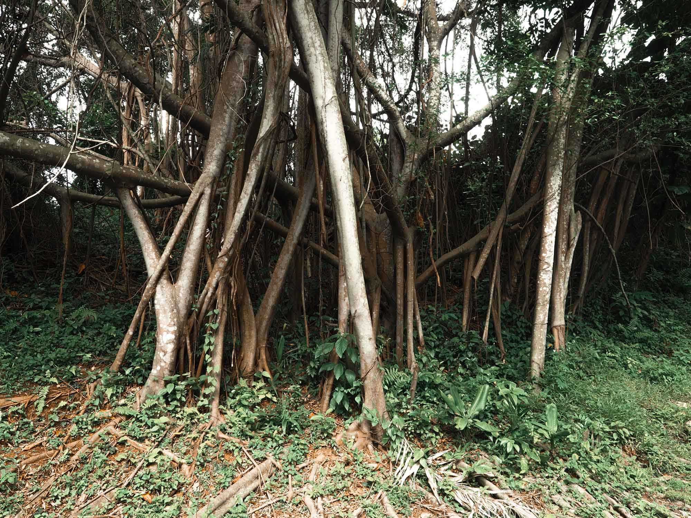
  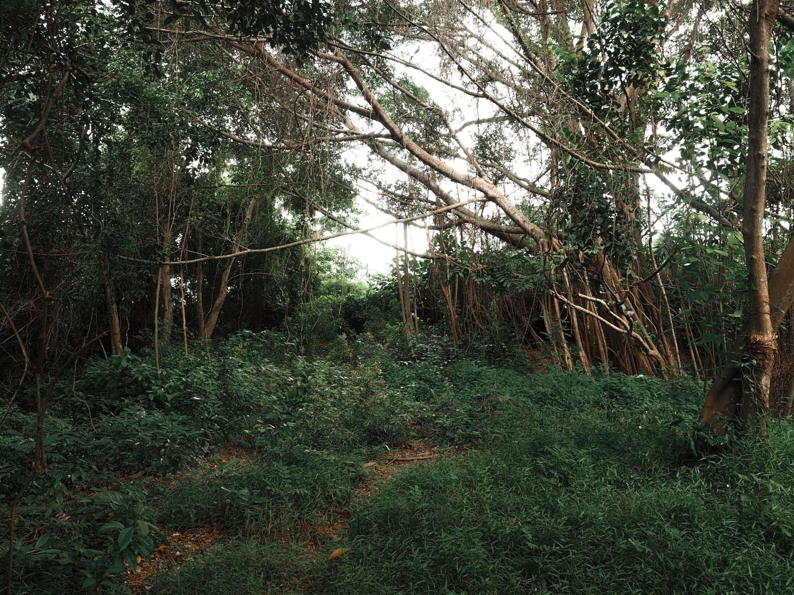
  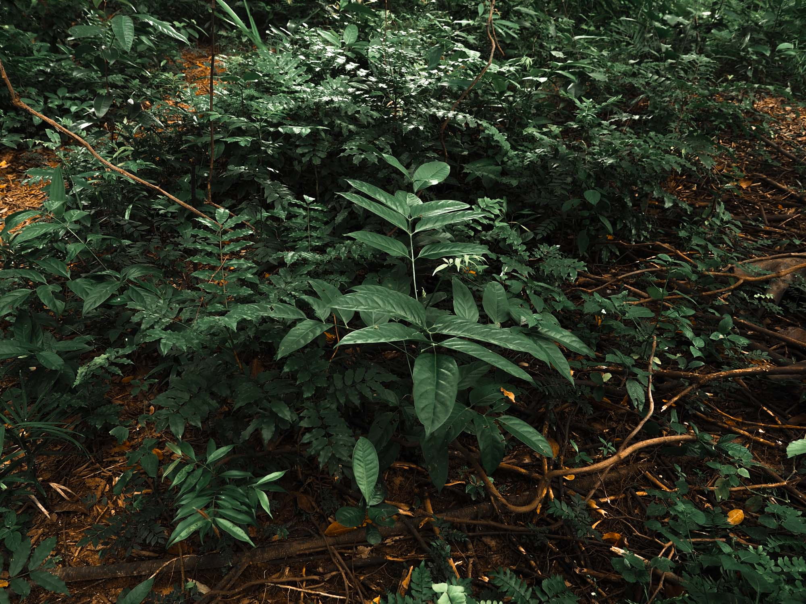
  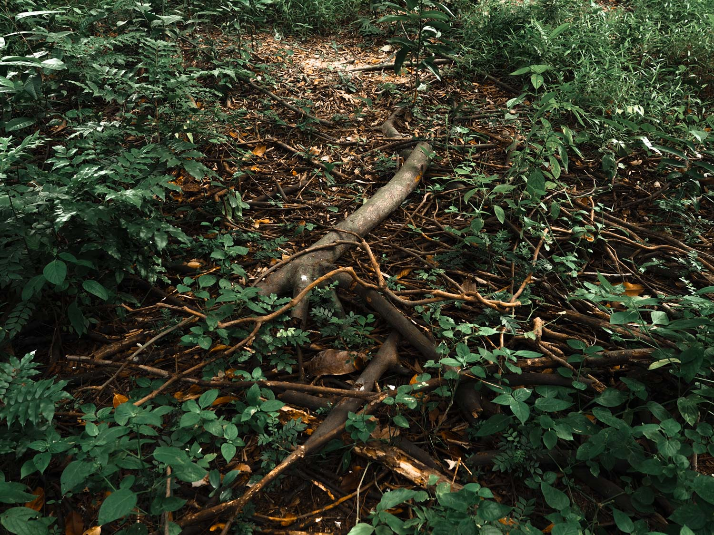
  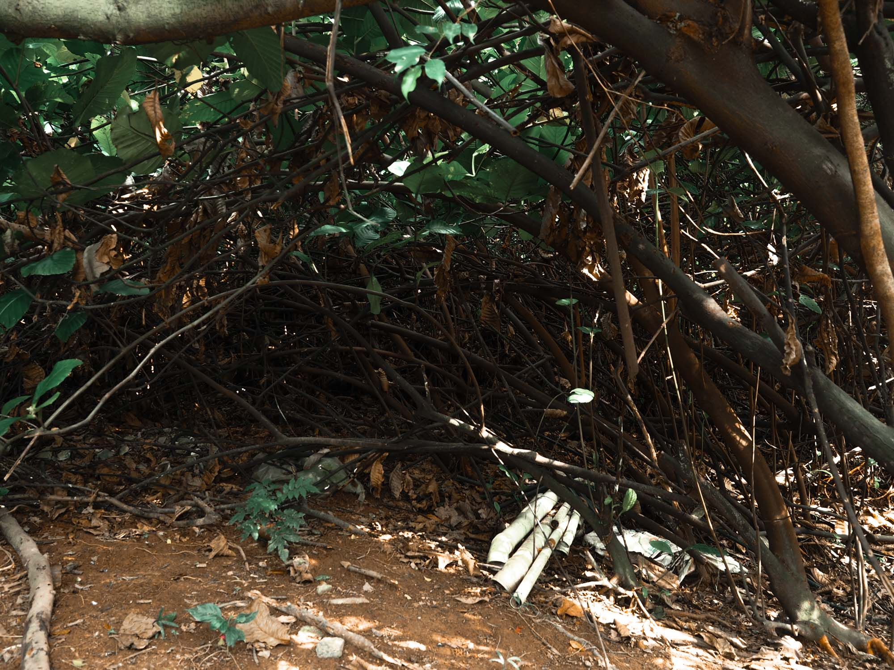
  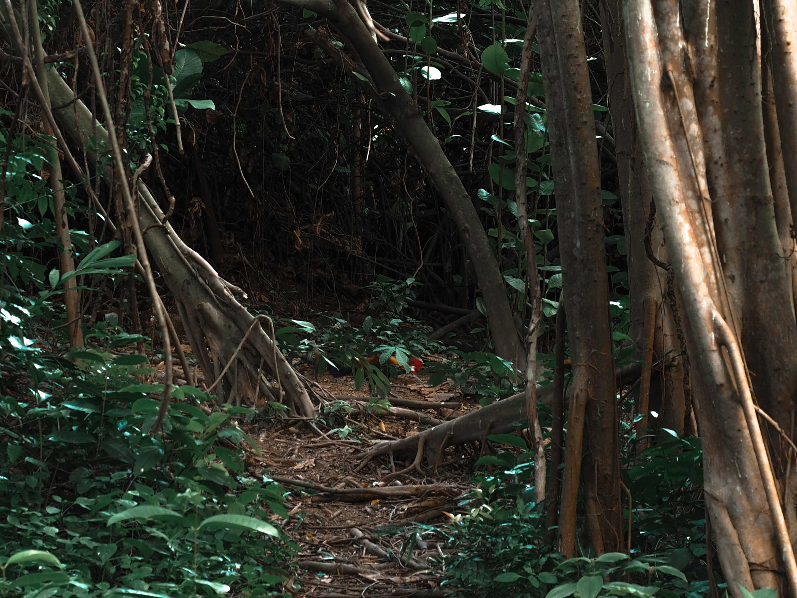
  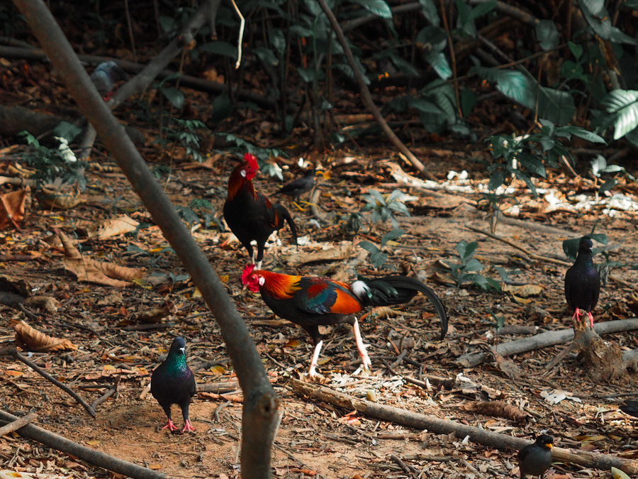
  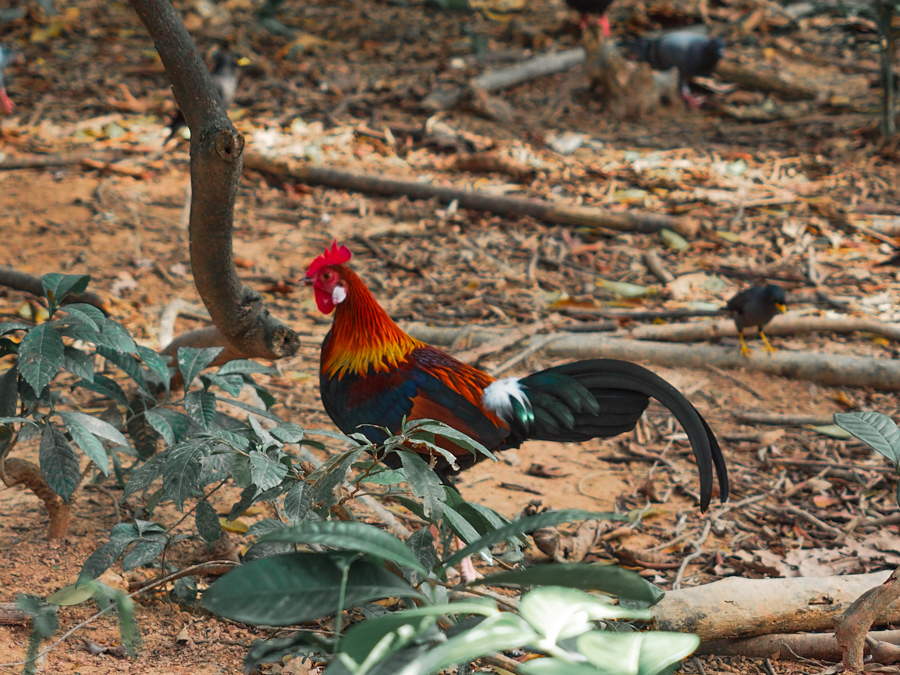
  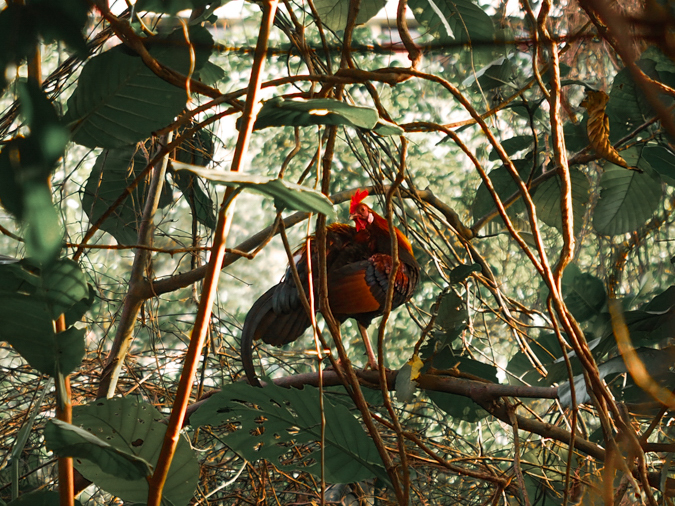


### Landscape Ecological Principles


  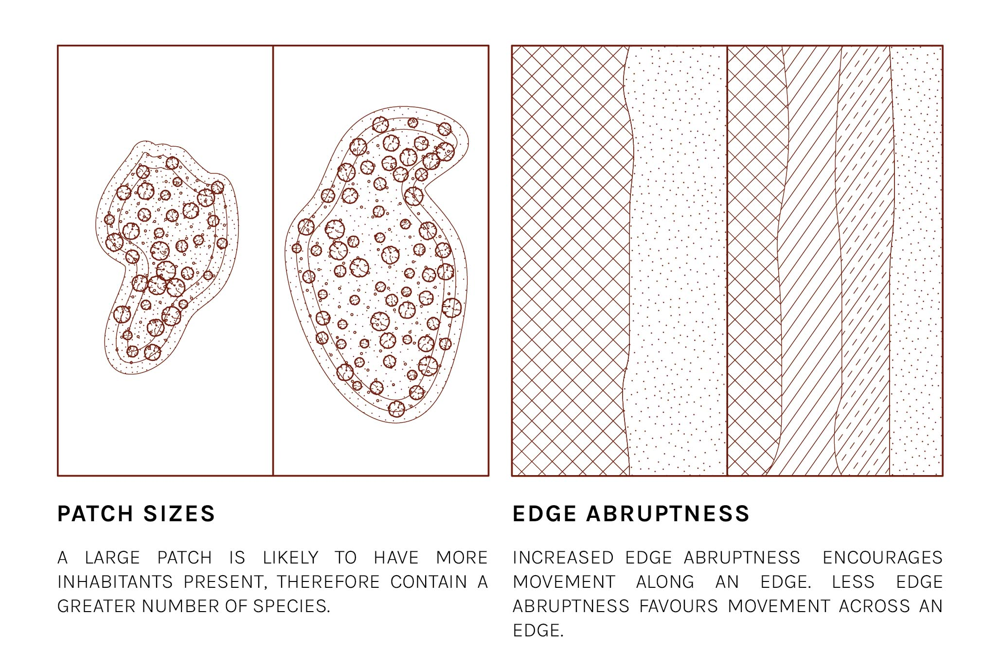
  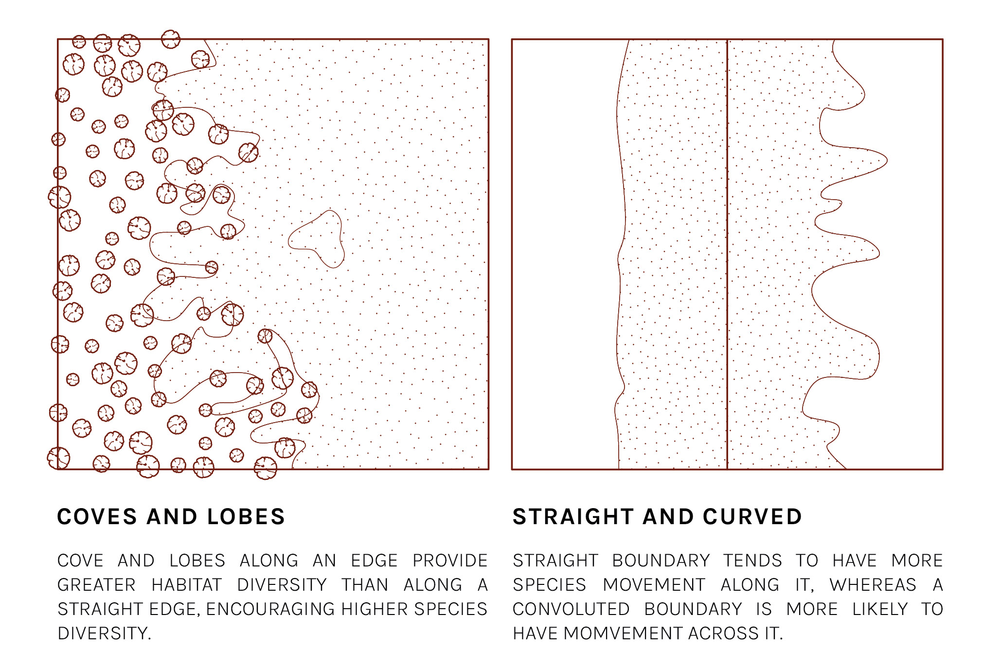
  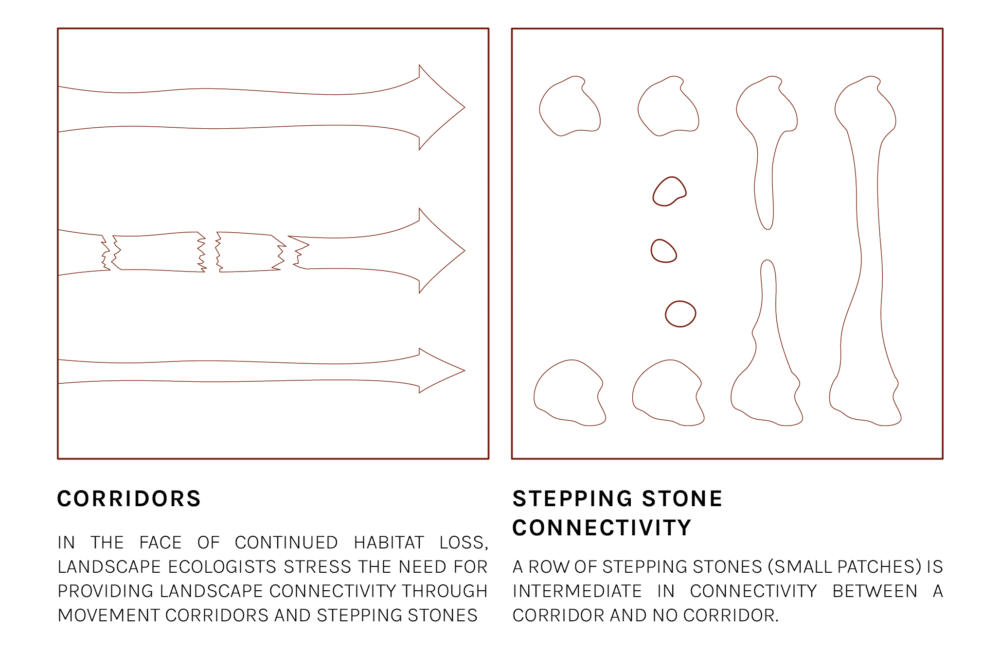



  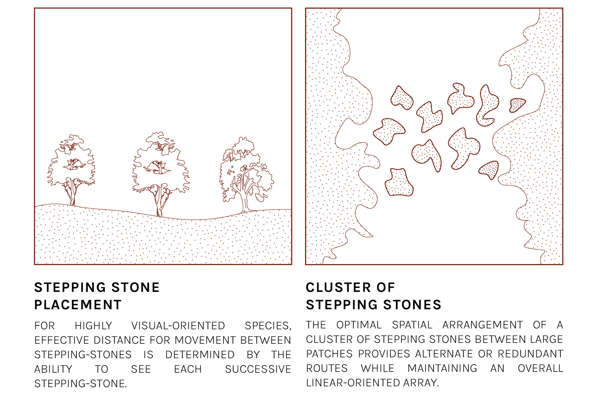
  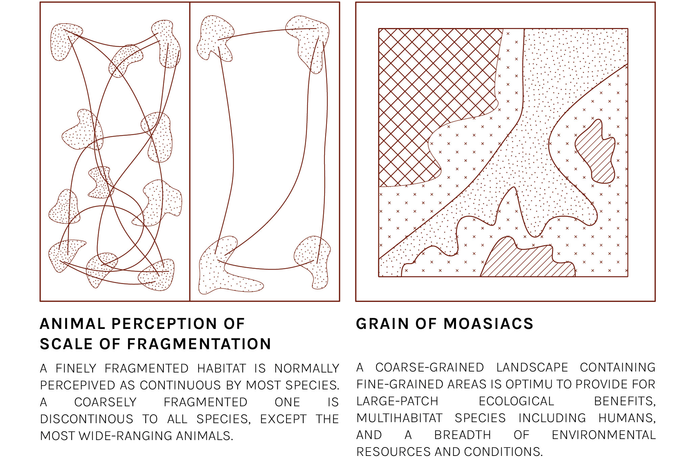


---

## Act II: Birds of a Feather



*(Update in Progress)*
