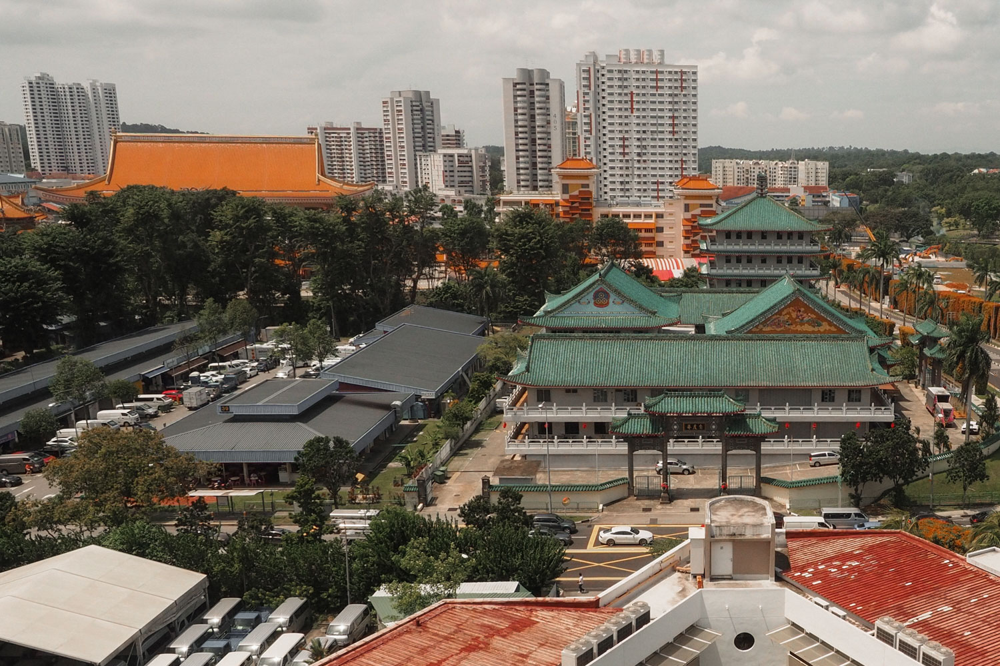
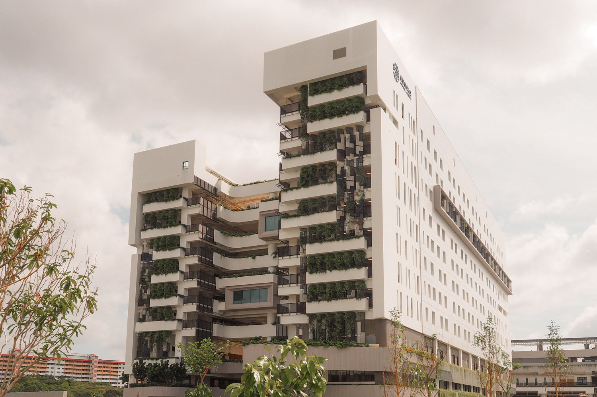
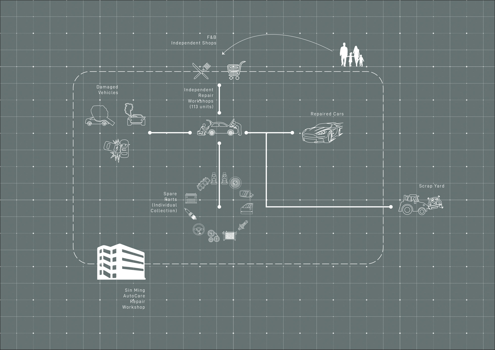
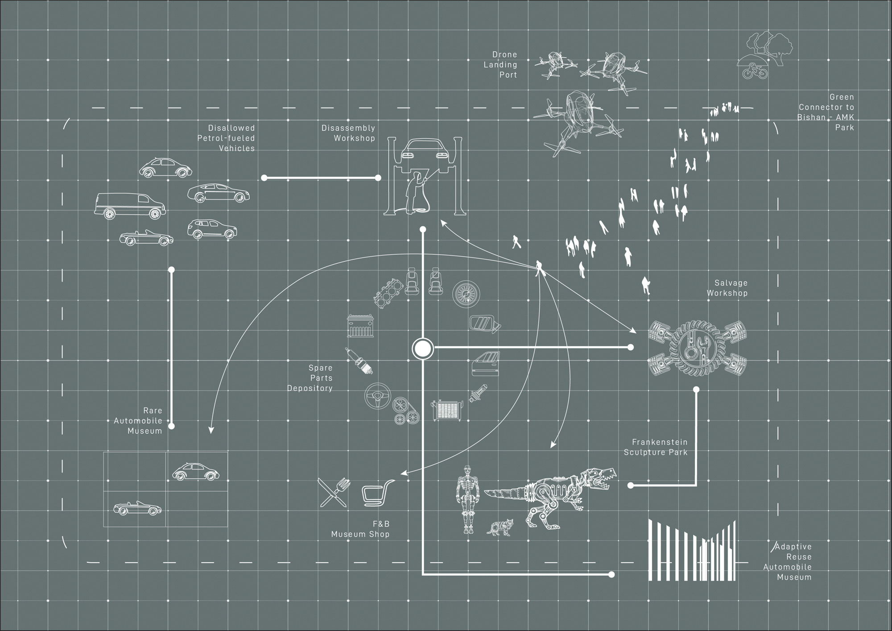
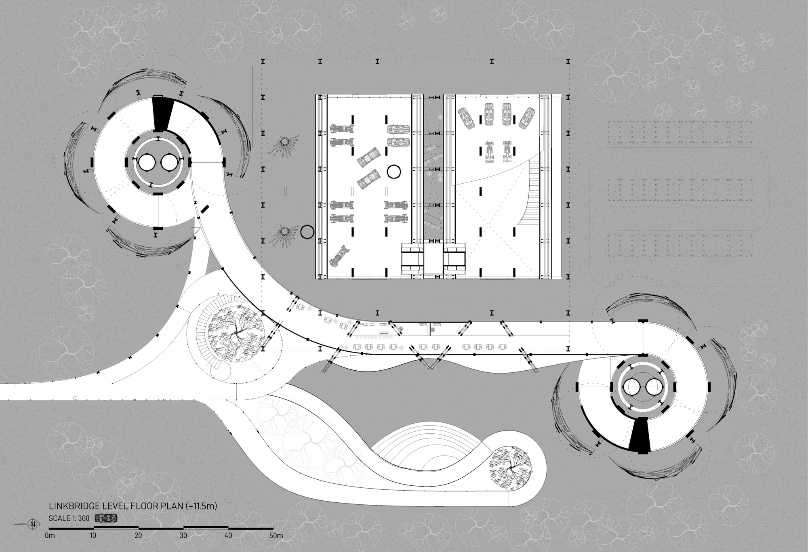
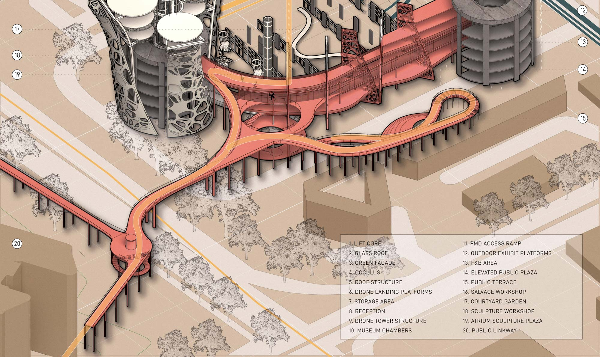
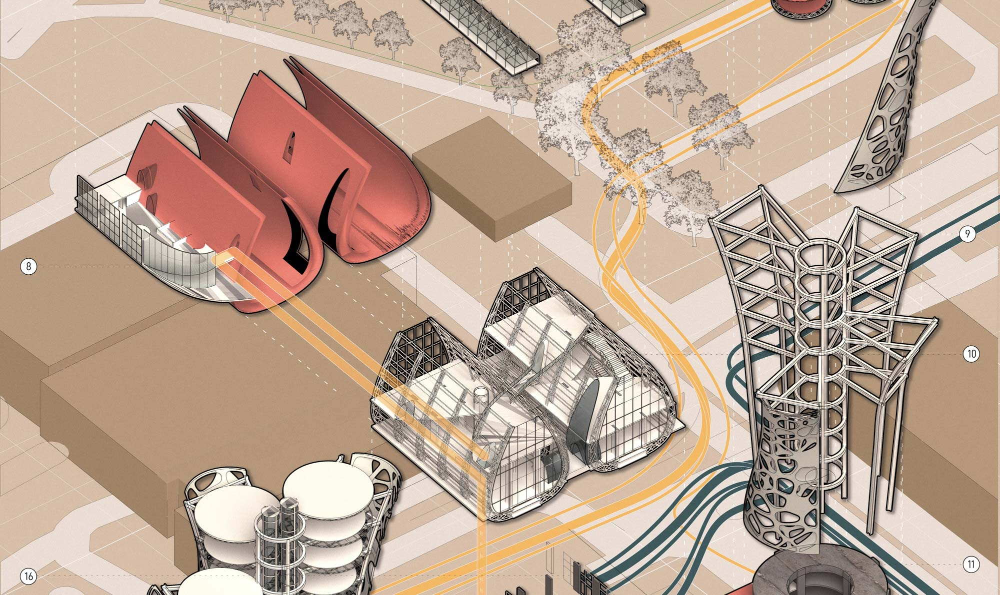
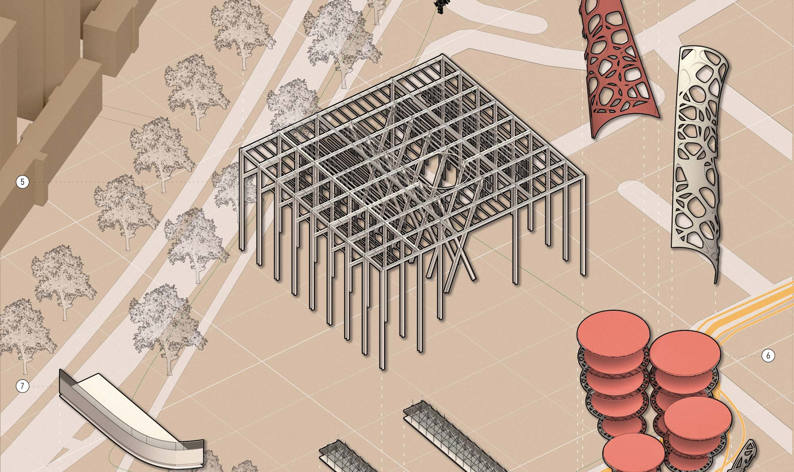
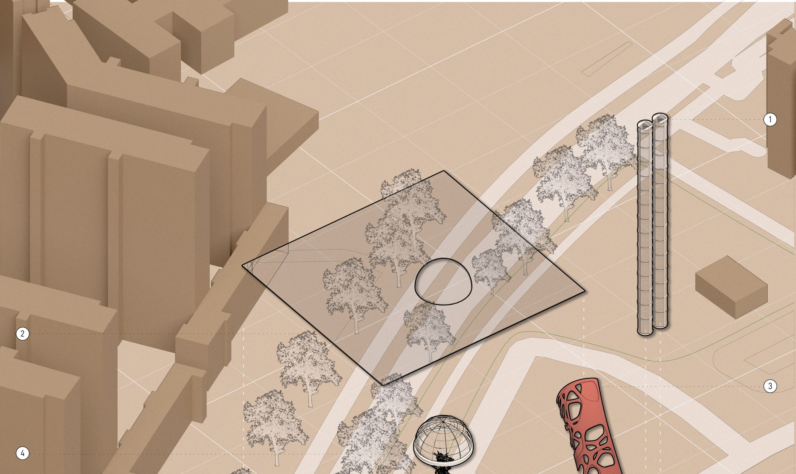

**M. Arch 1 Design Studio 8 |** NUS, Singapore

The 'rumours' of Singapore's move toward a car-lite (car-free eventually) future were all but confirmed in the recent release of the Singapore Budget, 2020. Under the Land Transport Master Plan 2040, the state has committed to encouraging the adoption of cleaner and greener means of transportation to fuel the land transport sector. The outphasing of the Internal Combustion Engine (ICE), a pipe dream even for the most radical environmentalist, may no longer be one come 2040.

This project speculates upon the designing of architecture in a car-free society. In such a future, increasingly underutilized auto-related infrastructure such as parking garages are repurposed to house Urban Air Mobility (UAM) infrastructures to augment the current land based transport solutions. The integrated transport network will provide immediate, comfortable and efficient transportation pan-island as our vehicles take to the sky.

---

## Singapore's Car-lite Future

Car ownership in Singapore currently sits at 11%, a fraction of the figure in the US and Europe, nearly 80% and 50% respectively. Transiting into a 'car-lite' future will see the focus on personal mobility shift from an ownership driven model to one that prioritizes immediacy of access.

One key departure from conventional transport planning highlighted by the Transport Ministry to address the increased demand for mobility is Singapore's foray into (UAM) Infrastructure. Taking into account existing land use plans, the prevalent and planned transport infrastructure within the city-state, a total of 11 sites have been identified to position (UAM) Hubs with an operational omni-directional radius of 5km (Civil Aviation Authority of Singapore (CAAS) Aerodrome guidelines).

These 'Drone-Hubs' will provide 100% air-coverage islandwide sans restricted areas such as military training grounds.

### Site 6: Bishan-Ang Mo Kio District

As we approach the issue of locating of these new 'Drone-Hubs', our 'car-lite' trajectory provides us a stellar opportunity in the form of repurposing increasingly underutilized multistory parking garages and related automobile auxiliary support infrastructures.



The Sin Ming Autocare Facility is a 6-storey auto repair cum parking facility, completed in 2000. It comprises some 105 units specializing in trades in the motor workshop related industries with many coming here to service or modify their prized vehicles. The building sits within a larger auto-related industry complex including several parking garages and other repair outfits.



Its proximity to several educational institutes, religious and cultural sites, the planned North-South Corridor (slated to be completed in 2026) and the Bishan-Ang Mo Kio Park offers a host of untapped potential for urban connectivity.


  
  
  


#### Where will dead cars go to die?

Amidst the day-to-day repair work, many people bring their vintage and prized cars to the Sin Ming Autocare center for custom overhaul jobs. In *The Psychology of the Car: Automobile Admiration, Attachment and Addiction*, Stefan Gössling understands the phenomenon of car culture as one of egocentrism. From sticker decals to full body custom overhauls, the automobile has been one of the few objects, where man, universally, has increasingly projected their identities onto. The car serves as an extension of self becoming outward expressions of self constructs.



The Sin Ming Autocare building is one such edifice to this egocentricity. Cars enter this facility in two states, damaged or deemed to look too unspectacular. Spare parts are cannibalized fiendishly, welded, painted and polished to a high sheen all in a desperate bid to reflect an imagined persona car owners seeks to project.

When these petrol fueled cars are no longer allowed freely on the roads, where will they go to 'die'?

Operating as one node within the network of (UAM) drone hubs, the scheme proposes transforming this repair facility into a final resting place for automobiles. To move into a car-lite society is an opportunity to move away from the egocentrism of the car culture. These cars, once privately enjoyed can now be reimagined as vessels to be integrated back into society. Some will continue to be appreciated as their designed wholes but, more interestingly, most will feature as key elements of a community driven deconstruction process of now defunct vehicles into their constituent parts.


  
  


## Design Methodology

1. **Redefining the building programme** to better engage the dissociated public realm
2. **Reinterpreting existing architectural structures** to facilitate connection rather separation

## Design Proposal


  
  
  




### Circulation and Tectonics


  
  
  
  


## Vision for the Future

The existing facility towers are characterized by imposing unadorned vertical volumes. Their prominent silhouette offer no connection with their surrounding environmental or social context.

The re-expression of these towers through the facade fins stand as metaphors for renewed connectivity to the community and environment. It is an architecture that heralds society's transition into aerial mobility, one that hopes to dismantle the egocentrism laden in our existing automobile culture.
