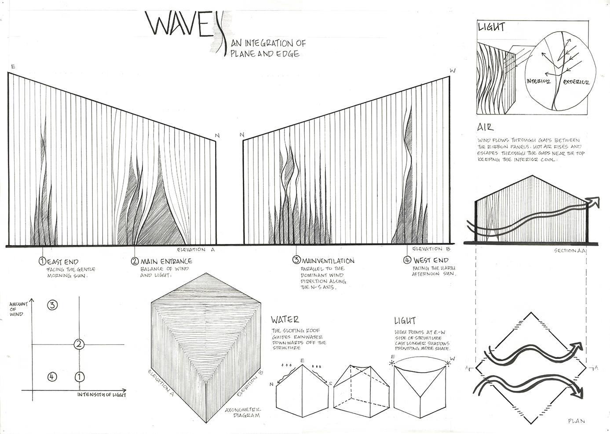
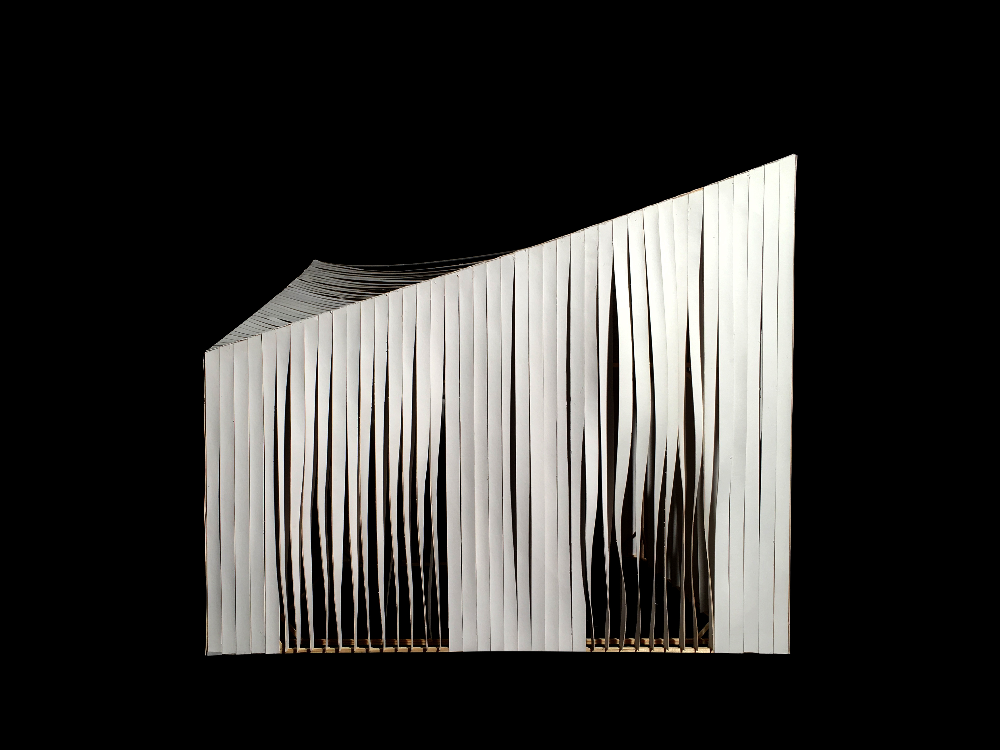
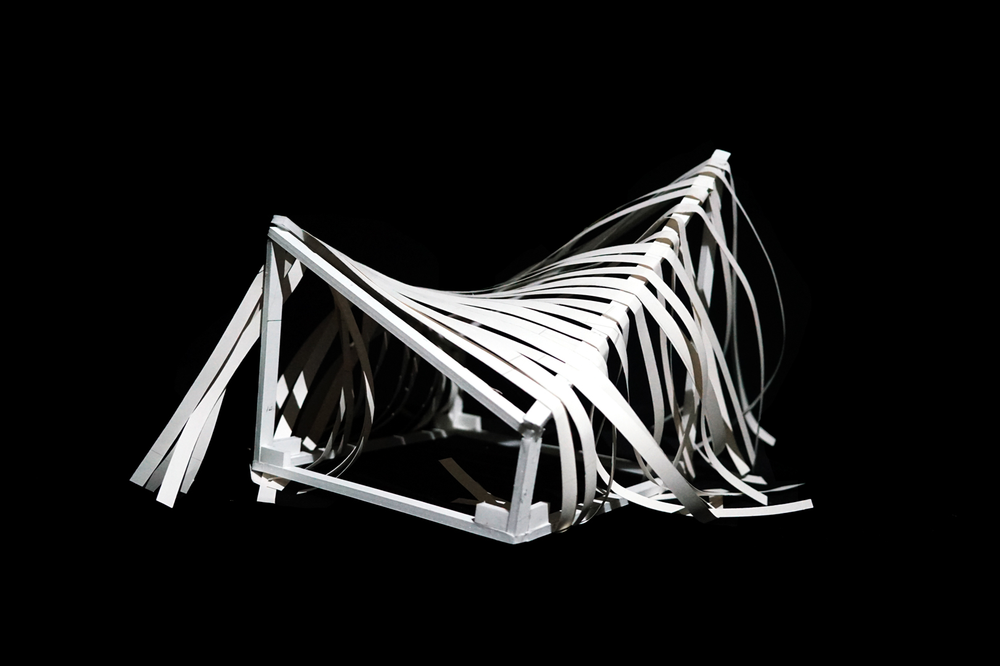
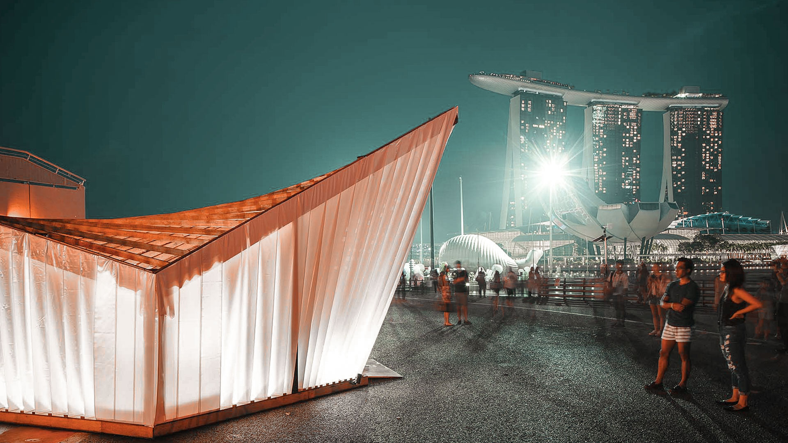
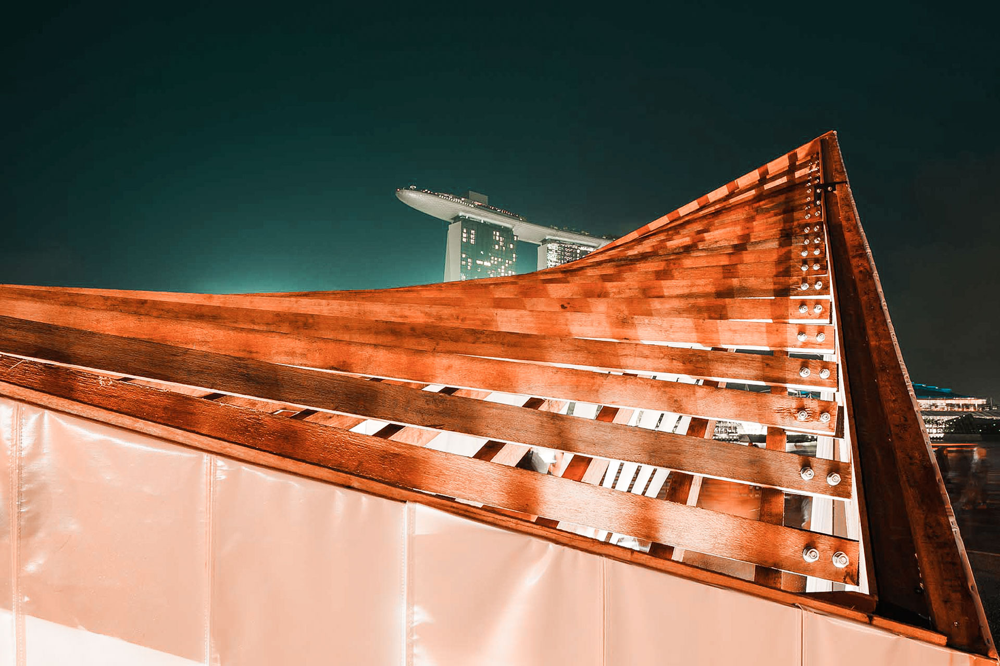
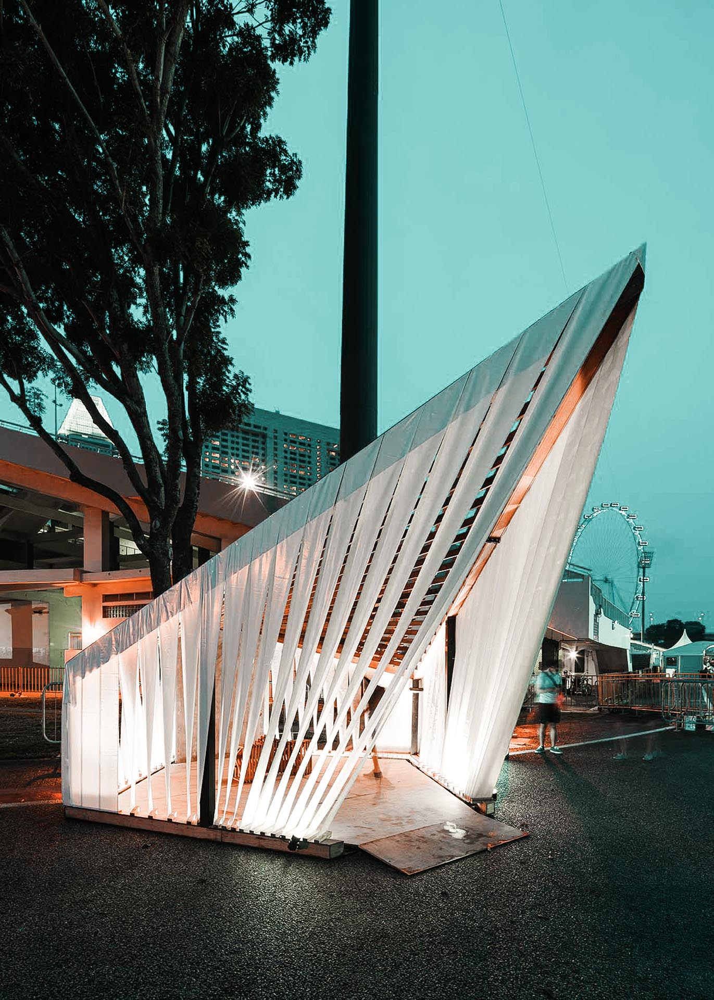
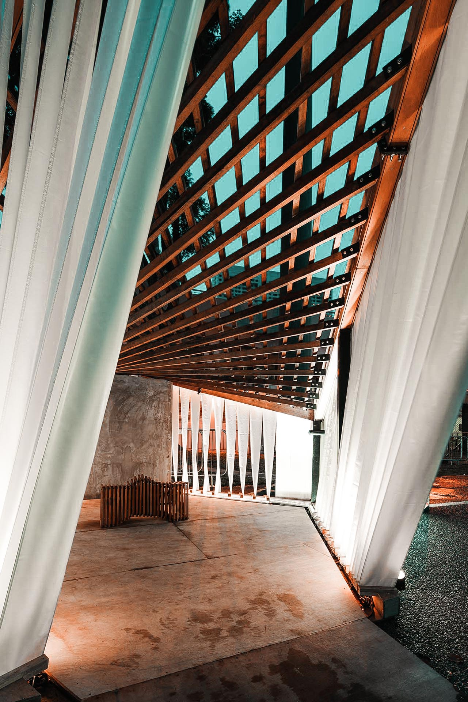
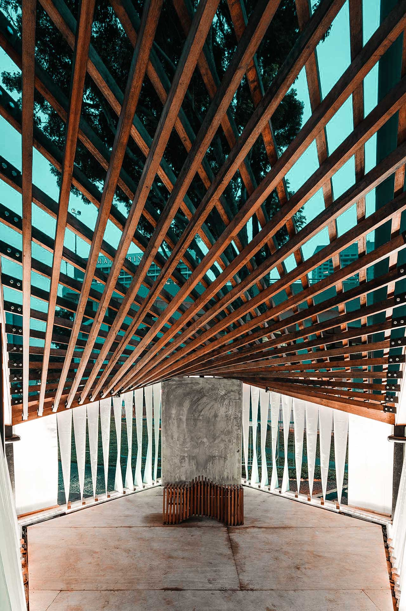
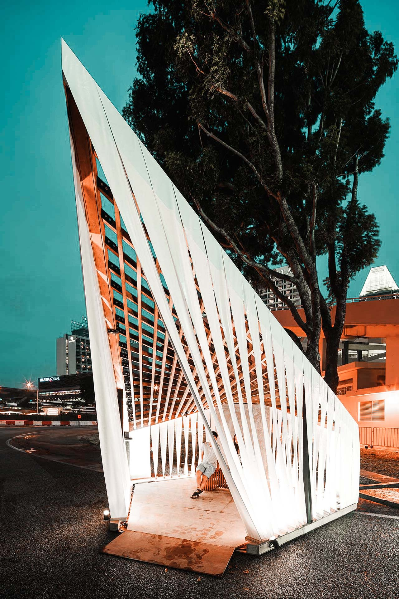
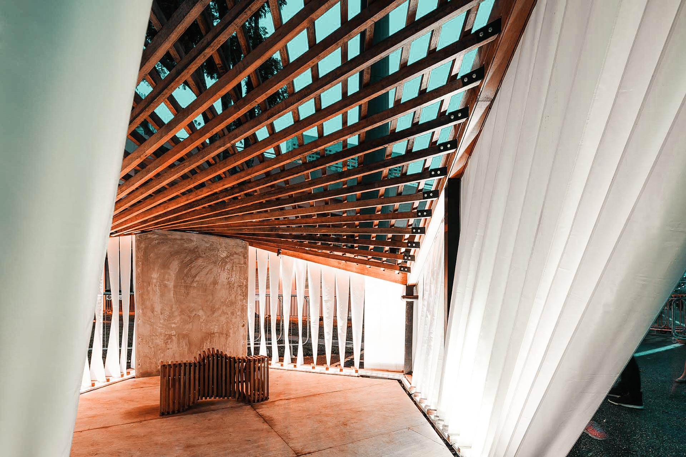

**NUS Architecture → iLight Marina Bay 2017 |** Singapore

This project began as an exploratory exercise in designing tropical envelopes for a public pavilion structure.

Our team was subsequently selected to represent NUS Architecture at Singapore's largest sustainable light art festival, iLight Marina Bay.

---

## Conceptual Models


  
  
  


### Interior Quality



### Exterior Quality



## Form Development

## Final Prototype




  
  
  
  
  
  
  
  


## Artist Impressions

On 3 March 2017, iLight Marina Bay 2017 opened to the public at Singapore's Central Business District.

We were installation no. 14.


  
  
  
  
  
  
  


### The Team
