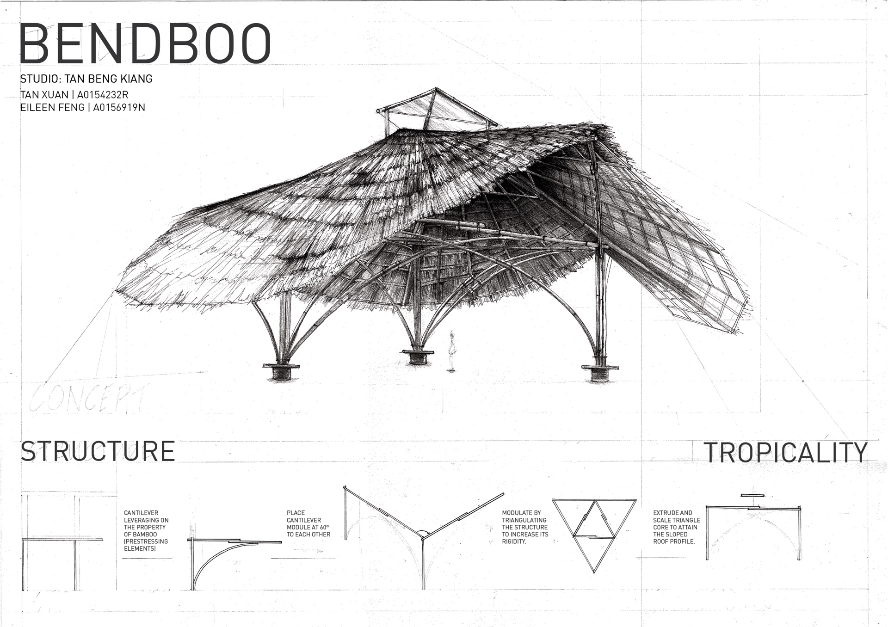
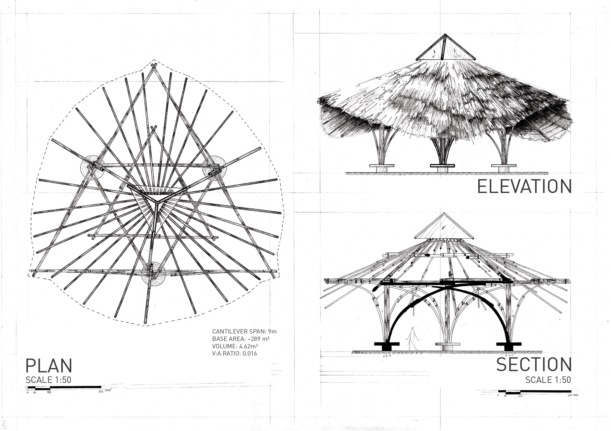
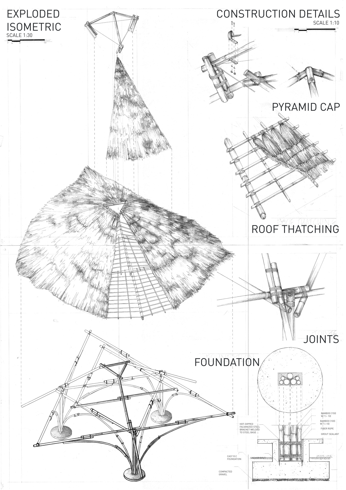
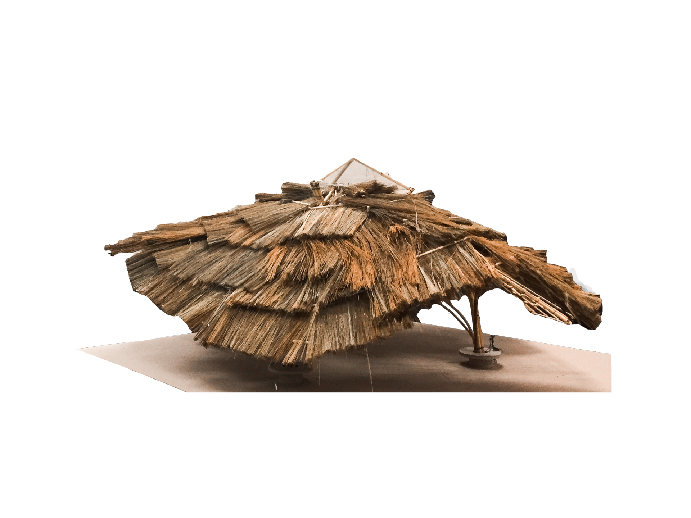
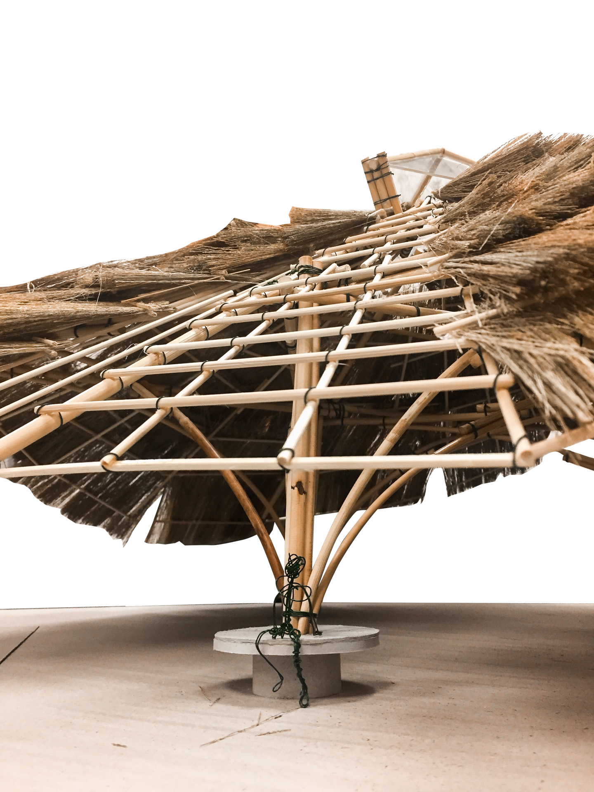
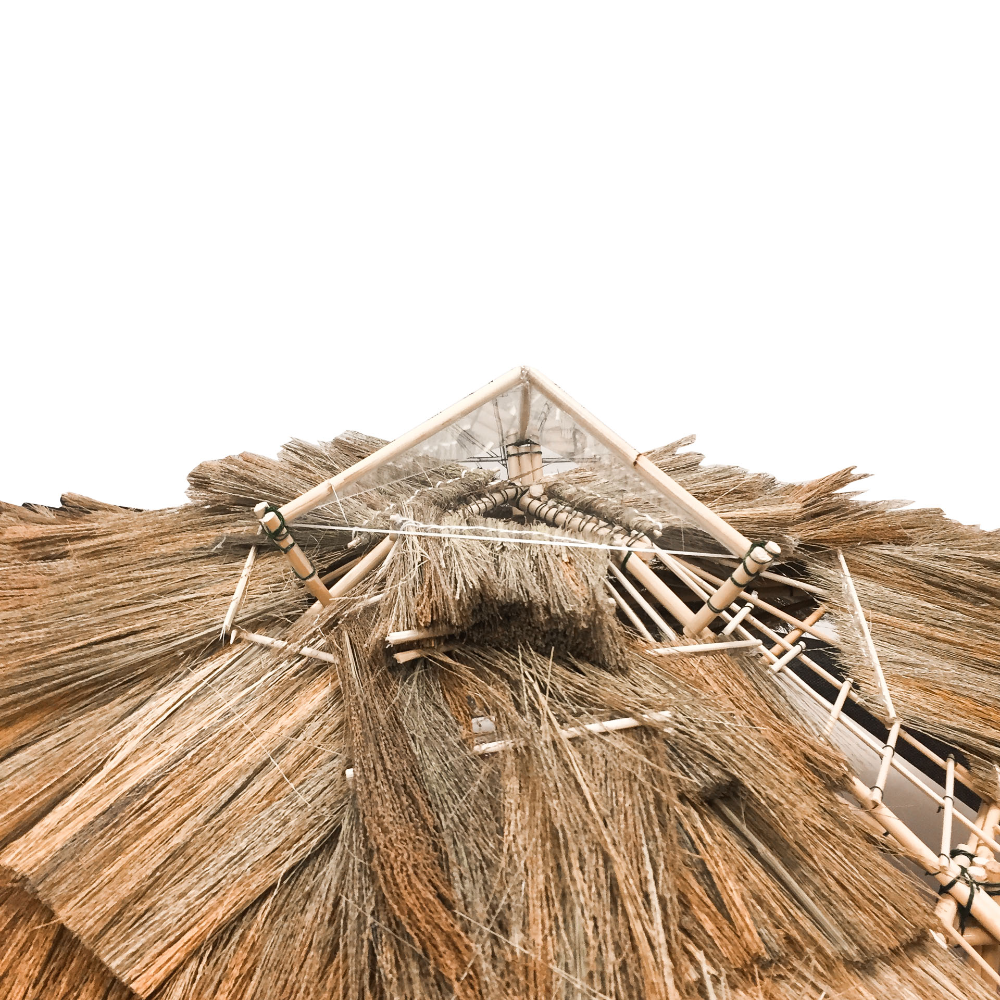
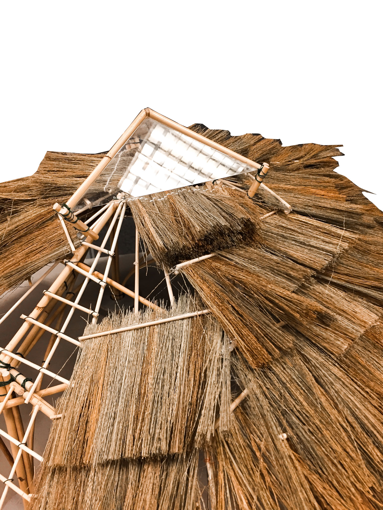
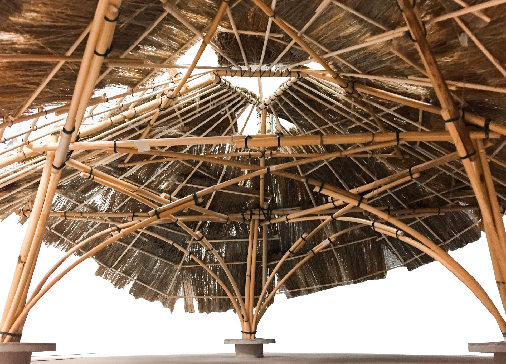

**B. Arch Design Studio 3 |** NUS, Singapore

BendBoo was imagined as a simple large span tropical roof, utilising traditional materials and construction techniques to reflect and inspire an eco-friendly, low carbon footprint approach to designing in the tropics.

Simplicity is Key. The basic geometry of the triangle was chosen to convey the design intent. The inherent strength of the triangulated form allowed for the creation of a stable architectural form which we tessellated to achieve the functional requirements of the roof.

The unique bending property of bamboo was exploited for its physical strength and flexibility in the design of curves. This project explored the boundaries of what the material of bamboo can offer to create eco-friendly sustainable design in the tropics.

## Plans. Sections. Elevations 1:50


  
  
  


## Scale Model 1:20


  
  
  
  
  
  

