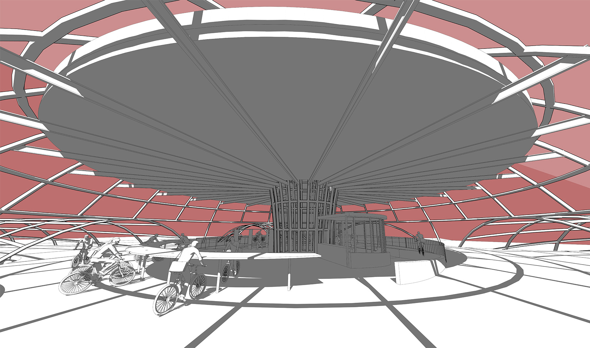
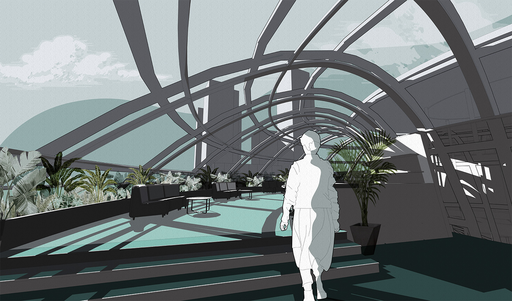
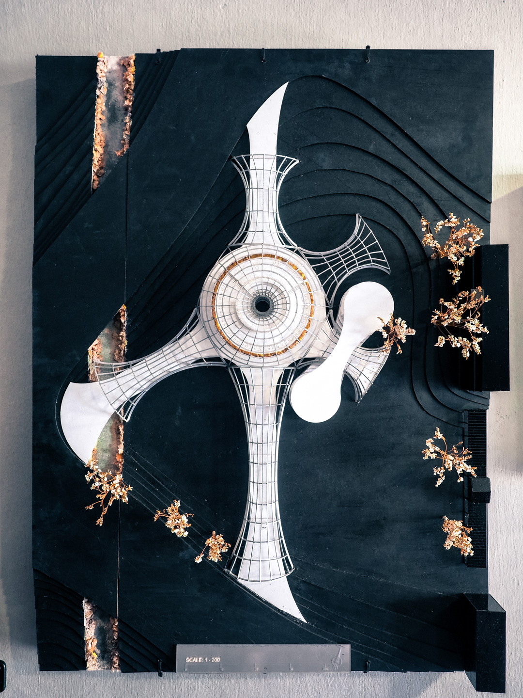
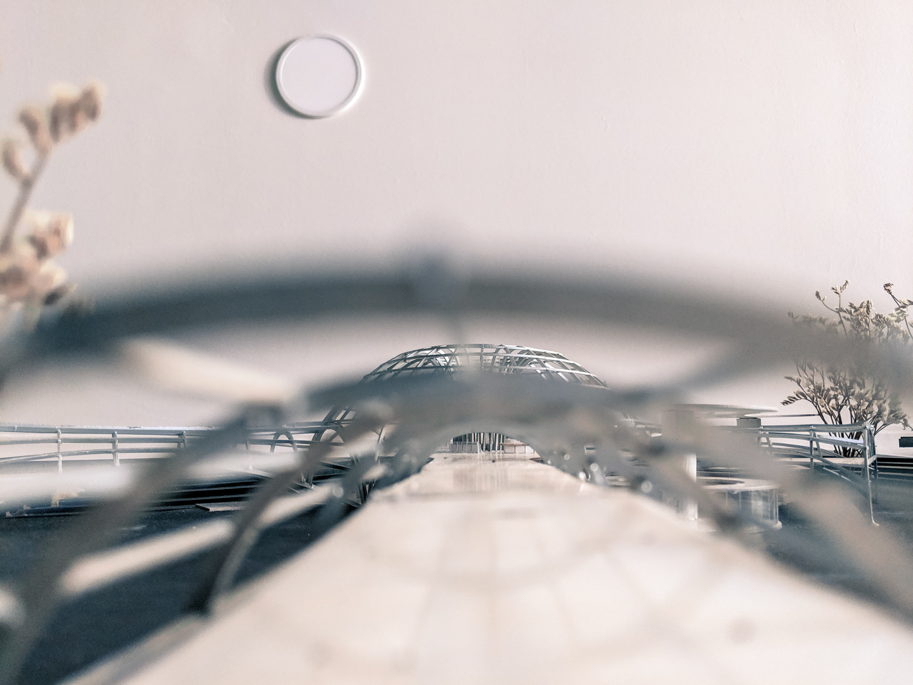
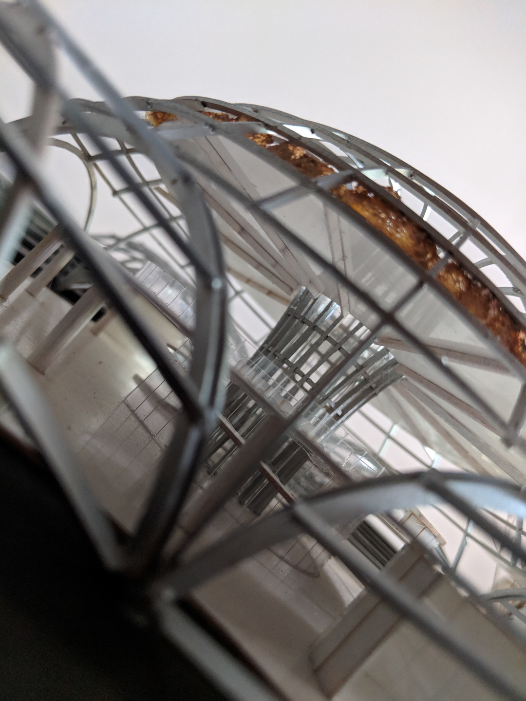
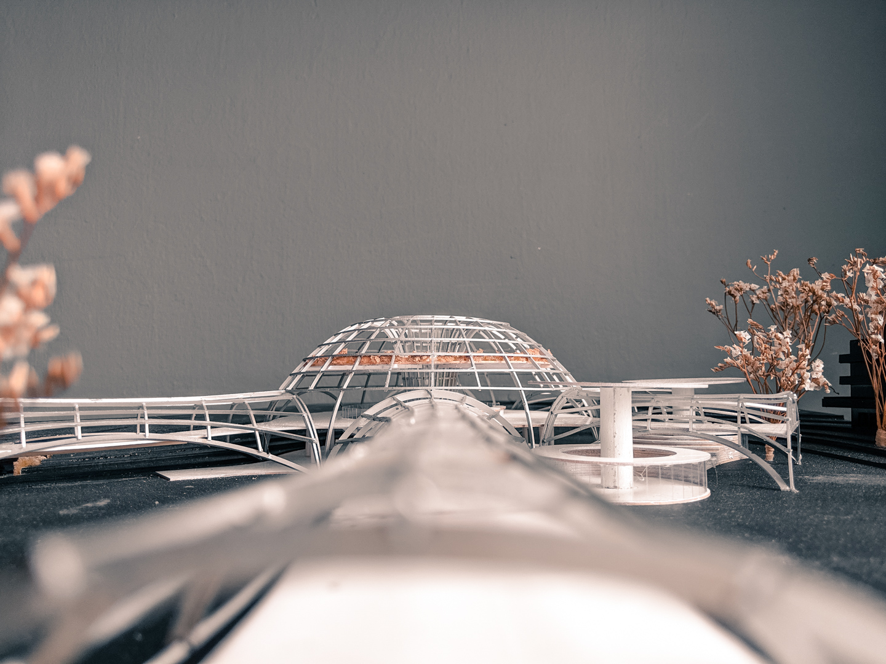

**B. Arch Design Studio 6 |** NUS, Singapore

This project envisions the design of an experimental typology in Singapore — a bicycle hub along a busy street intersection on North Buona Vista Rd and Commonwealth Ave.



Cycling in Singapore is not as popular in bike-integrated cities like Amsterdam or Taipei, but it can be best described as a tale of two cultures.



On one hand, fast enthusiast cyclists prioritise speed and efficacy, a spectral alternative slipping through the chaos of rush hour. On the other, slower cyclists meander through park connector networks, taking in the sights. A few brave souls join their ranks, running the occasional errand under the Singapore sun.

Following a qualitative study of both types of cyclists, I theorised that their speed and posture created divergent perceptions of space.

The **Slow cyclists** sat upright, hands gently placed on pulled back handle bars. They engaged in a satellite orbital vision — each passing event observed and connected. They pass through space and time, point by point in a regulated staccato.

The **fast cyclists** leaned forward, pedalling in a strict tunnel vision within a 20–55° cone. Buildings de-materialise, disappearing in a blur as you settle into clicking pedals, re-emerging at traffic stops. A sensory assault.

---

## Historic Rail Corridor, Buona Vista

### Site Analysis





## The Third Pace

### Design Proposal


  
  









  
  


### Scale Model 1:200


  
  
  
  

